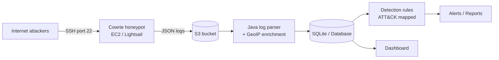

# 🍯 HoneyTrace: SSH Honeypot & Threat Detection Pipeline

> An internet-facing SSH honeypot on AWS that captures real attacker behavior, turns raw logs into structured intelligence, and maps what it sees to MITRE ATT&CK.


---

## 📌 Overview

Most security projects run tools against practice targets. **HoneyTrace** works the other way around: it exposes a deliberately fake SSH server to the public internet, records everything attackers do to it, and analyzes that data.

The project answers questions like:

- Who is attacking, and from where?
- Which usernames and passwords do bots try most?
- What commands do attackers run after "getting in"?
- Which ATT&CK techniques do these behaviors map to?
- Can I write detection rules that flag this behavior automatically?

## 🎯 Goals

1. Deploy a hardened, isolated honeypot on AWS
2. Collect and store attack logs reliably
3. Parse, enrich (GeoIP), and analyze the data
4. Write detection rules mapped to MITRE ATT&CK
5. Visualize findings in a dashboard
6. Publish a findings report with real numbers

## 🏗️ Architecture



> *Diagram will be updated as the design evolves.*

## 🧰 Tech Stack

| Layer | Tool |
|---|---|
| Honeypot | [Cowrie](https://github.com/cowrie/cowrie) |
| Hosting | AWS EC2 t3.micro / Lightsail (isolated VPC) |
| Log storage | Amazon S3 |
| Language | Java 21 (Maven) |
| Log parsing | Jackson |
| Enrichment | MaxMind GeoLite2 (`geoip2` Java library) |
| Storage | SQLite via JDBC |
| Testing | JUnit 5 |
| CI | GitHub Actions (`mvn test`) |
| Visualization | Grafana / Spring Boot dashboard *(TBD)* |
| Framework | MITRE ATT&CK |

> Cowrie itself is written in Python and runs on the server. All analysis code in this repo is Java.

## 🔒 Threat Model & Safety

This honeypot is intentionally exposed, so it is isolated by design:

- Runs in its own VPC (ideally its own AWS account) with **no other resources**
- Real admin SSH is moved to a non-standard port, key-only, restricted to my IP
- No real credentials, personal data, or internal network access on the host
- Outbound traffic is restricted to prevent the host being used to attack others
- Budget alarm set to prevent surprise costs
- Logs are treated as untrusted input when parsed

See [`docs/threat-model.md`](docs/threat-model.md) for the full analysis.

## 📁 Repository Structure

```
honeytrace/
├── README.md
├── LICENSE
├── .gitignore
├── docs/
│   ├── threat-model.md
│   ├── setup-guide.md
│   └── findings.md
├── pom.xml
├── deploy/            # Honeypot install & hardening scripts
├── src/
│   ├── main/java/com/honeytrace/
│   │   ├── parser/        # Cowrie log parsing
│   │   ├── enrich/        # GeoIP enrichment
│   │   ├── storage/       # SQLite persistence
│   │   ├── detection/     # Detection rules (ATT&CK mapped)
│   │   └── Main.java
│   └── test/java/com/honeytrace/
├── dashboard/         # Visualization
└── data/              # Sample/sanitized data only
```

## 🗺️ Roadmap

- [ ] Repo setup, README, threat model
- [ ] Isolated AWS instance launched and hardened
- [ ] Cowrie installed and logging
- [ ] Log shipping to S3
- [ ] Parser v1
- [ ] GeoIP enrichment
- [ ] Detection rules mapped to ATT&CK
- [ ] Dashboard
- [ ] Findings report
- [ ] Demo video and final polish

## 🚀 Setup

*Coming soon. Full deployment steps will live in [`docs/setup-guide.md`](docs/setup-guide.md).*

## 📊 Findings

*Results will be added here once enough data has been collected.*

| Metric | Value |
|---|---|
| Collection period | TBD |
| Total connection attempts | TBD |
| Unique source IPs | TBD |
| Countries observed | TBD |
| Most common username | TBD |
| Most common password | TBD |

## 🧠 MITRE ATT&CK Mapping

| Observed behavior | Technique | ID |
|---|---|---|
| Repeated login attempts with common credentials | Brute Force | T1110 |
| *(more to be added from real data)* | | |

## 📚 Lessons Learned

*To be written as the project progresses.*

## ⚠️ Disclaimer

This project is for educational and defensive research purposes. The honeypot only observes traffic sent to it and never attacks or scans other systems.

## 📄 License

MIT. See [LICENSE](LICENSE).

## 👤 Author

**Your Name** · [GitHub](https://github.com/your-username) · [LinkedIn](https://linkedin.com/in/your-profile)
